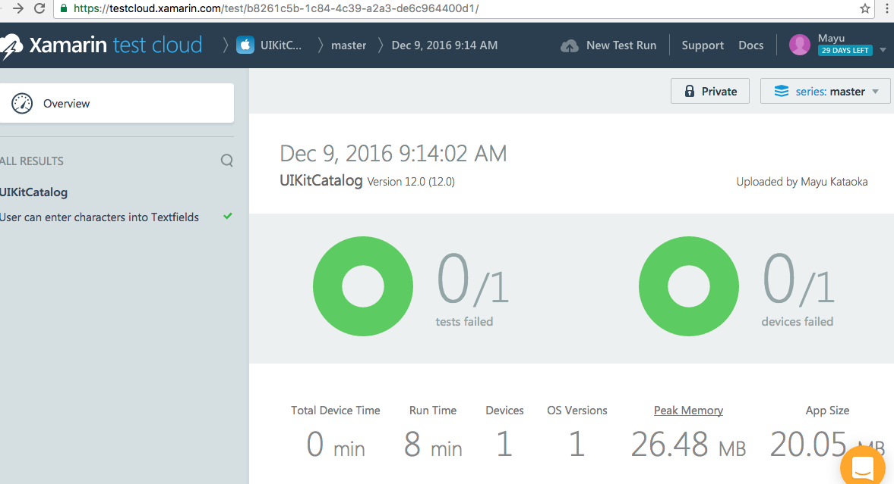

## calabash-demo

## How to create ipa without developer account requiring you to pay $99 a year.

1)Clean your project.

2)Build your project.

3)Go to products menu -> select build for -> select Profiling.

4)In project navigator, find you .app product.

5)Right click on it and click show in finder.

7)Create a folder named "Payload", copy that .app file in this folder.

8)Archive your folder.

9)After archive, rename your folder to name of your app and change its extension from ".zip" to ".ipa"

10)Your ipa is ready for sharing.

## How to run a Calabash test locally with an iOS simulator
    bundle exec cucumber
## How to run a Calabash test with Test Cloud
    test-cloud submit /Users/mk/Library/Developer/Xcode/DerivedData/UIKitCatalog-ghqralqwepidpgfednnnzqwsentm/Build/Products/Debug-iphoneos/ <your XTC TEAM API KE> --devices 9e98a780 --series "master" --locale "en_US" --user <XTC USER ID>

## Screenshot from Test Cloud

